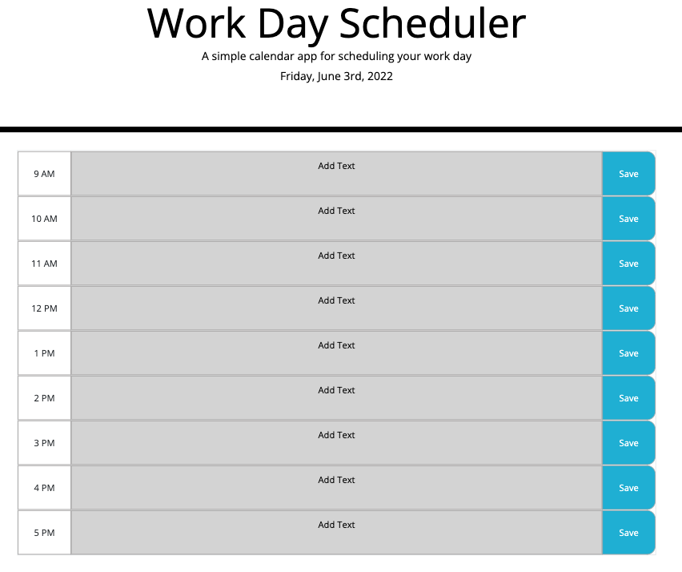

# Employee Daily Planner
### Organize your day with this easy to use daily planner!

## Tasks Completed 

- Create a daily planner to create a schedule
- The current day is displayed at the top of the planner
- Traditional Work Hours are displayed with color coded functionality used to indicate whether it is in the past, present, or future
- Edit your timeslot by clicking on the textarea
- Save your plans indefinitely by pressing the corresponding 'Save' button

### Check it Out!!
#### [Employee Daily Planner Webpage](https://jasminedaniels.github.io/AstroBlastro217/)

